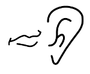

# small-speech

Quickly record and replay later audio notes.
This app does not support very long audio files, but it's very convenient to quickly record and save a few seconds audio note.
It should work on old devices as well (not tested though).

Every audio record is saved in a file with a timestamped name.
When replaying a previous audio note, the path to the raw audio file (16kHz, mono, 16 bits LE) is copied into the clipboard.

It's a work in progress for now.

## Features

- lightweight
- no tracker, no pub, no dependence to google services, open source - totally safe for your privacy !
- compatible old devices (from Android gingerbread)

